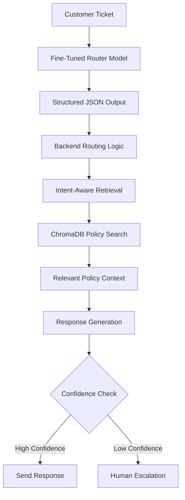

# SupportOrchestrator-AI

AI-powered customer support routing and retrieval orchestration system built using fine-tuned LLMs, FastAPI, ChromaDB, and React.

---

# Overview

SupportOrchestrator-AI is an enterprise-style AI operations platform designed to automate customer support workflows.

Instead of functioning as a generic chatbot, the system acts as an intelligent routing and orchestration engine that:

- classifies support tickets
- predicts priority
- routes issues to appropriate teams
- retrieves relevant policies using intent-aware RAG
- generates structured support responses
- escalates critical cases to humans

The project focuses on building a production-style AI workflow system rather than a simple conversational assistant.

---

# Core Features

- Fine-tuned LLM for ticket classification
- Structured JSON-based routing
- Intent-aware retrieval using ChromaDB
- FastAPI backend orchestration
- Enterprise React dashboard
- Escalation handling
- Retrieval monitoring
- Analytics and infrastructure metrics
- Modular production-style architecture

---

# Tech Stack

## Backend

- FastAPI
- Transformers
- Unsloth
- PEFT / LoRA
- ChromaDB
- Sentence Transformers
- SQLite / PostgreSQL

## Frontend

- React
- TailwindCSS
- shadcn/ui
- Axios
- Recharts

## AI / ML

- Llama 3.2 1B
- QLoRA Fine-Tuning
- Semantic Retrieval
- Intent Classification

---

# System Workflow



---

# Example Model Output

```json
{
  "intent": "billing_inquiry",
  "priority": "high",
  "confidence": 0.94,
  "department": "billing_team"
}
```

---

# Project Structure

```bash
backend/
frontend/
knowledge_base/
chroma_db/
support_router_model/
```

---

# Goals of the Project

- Build a realistic AI workflow orchestration system
- Reduce support ticket triage time
- Improve retrieval precision using intent-aware RAG
- Demonstrate production-oriented LLM engineering
- Create a scalable enterprise AI architecture

---

# Current Status

- Fine-tuned routing model completed
- Backend architecture designed
- Frontend enterprise dashboard designed
- Retrieval pipeline in progress

---

# Future Improvements

- Hybrid search (BM25 + Vector Search)
- Multi-label intent classification
- Real-time streaming responses
- Advanced analytics
- Kubernetes deployment
- Distributed inference

---

# Disclaimer

This project is built for educational and engineering demonstration purposes to explore production-style AI system design.
